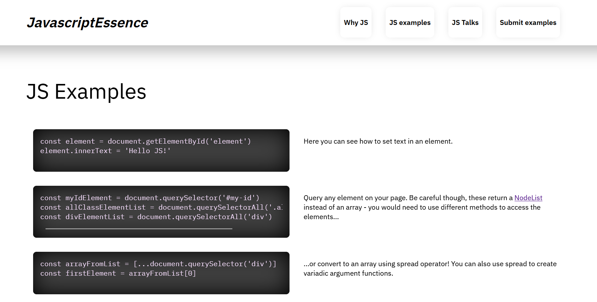
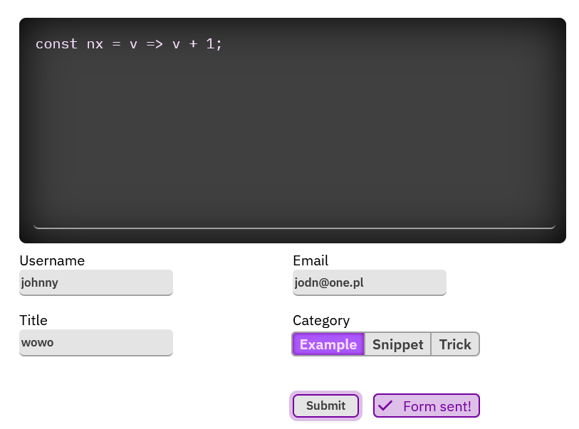

# README

## Demo Single Page App


Clicking on navigation link loads in new page, without reloading

Bundled with `FormController` for easier managment of forms

## What is that?

It's just a simple page controller, behaving as SPA (Single Page Application).
Despite its relative simplicity it turns out that the controller is perfectly
capable of handling every navigational request, no matter how complex and
register navigation history (so going back and forward).

Such simplicty was at least in some part achieved by utilizing reactiveness and
listeners - controllers rely on observers heavily. You then can harness the
power of that approach by binding/unbinding your own reactives and manage
state.

Nevertheless you will need to implement quite a lot of your own functions and
solutions - there is a form controller, but everything else is up to you to
build.

[LIVE DEMO](https://wdai-mikro-szym-mie.netlify.app)

## Build instructions

```bash
npm i
npm run build
```

## Deploy instructions

just serve `/public` directory, hosting can be done easily on Netlify
